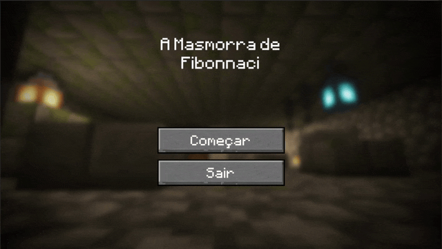

# Masmorra de Fibonacci 

	

Esse jogo foi criado em 2021 como uma atividade complementar do 2° ano do ensino médio para a disciplina de Matemática.

## Descrição 

O objetivo do jogo é escapar da masmorra de onde o jogador se encontra preso e, para tal, você deve superar um desafio mortal: responder três perguntas matemáticas.

	

## Como foi feito

A proposta dessa atividade era abordar as relações entre a razão aurea, número de ouro, espiral de ouro e a sequencia de Fibonacci. As apresentações deveriam ter um 
formato variado e criativo, por isso escolhemos fazer um jogo de quiz com questões relacionadas ao nosso tema. Os cenários foram construídos no Minecraft e os vídeos de 
transição e menu foram exportados utilizando o Replay Mod. Esses vídeos foram importados para a Unity onde foi feito o desenvolvimento do jogo em si.

|   	 **GRUPO**     |   	 	  **CONTRIBUIÇÃO**   	      |
| :------------------- | -----------------------------------: |
| **[Victor Hugo](https://github.com/kingofcactus/)**        | Programação e Edição   |                 
| **[Nicolas Oliveira](https://github.com/NicolasGoldner)**  | Minecraft e Introdução |
| **Will Emanuel**                                           | 1ª Questão             |
| **Leonardo Diogo**                                         | 2ª Questão             | 
| **Caio Ferreira**                                          | 3ª Questão	      |

